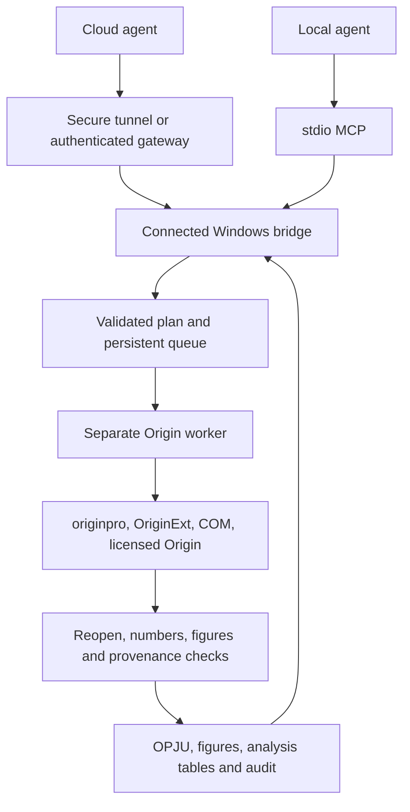

# Initial design: a cross-host Origin automation plugin

Historical design reviewed **2026-09-11**. This preserves the initial proposal and trade-offs; it is not the current implementation status. The subsequent independent Origin Agent Bridge 0.1.0 delivered Windows ZIP/MCPB, eight tools and native installed-package acceptance without a ChemAIst dependency. It later became Origin Companion. Consult the [current architecture](origin-agent/docs/ARCHITECTURE.md), [installation guide](origin-agent/docs/INSTALL.md) and [validation history](origin-agent/docs/VALIDATION.md).

## 1. Product decision

Users should control their own licensed Windows Origin through natural language in Claude, ChatGPT, WorkBuddy or another MCP-capable agent: import, analyse, plot, revise and export editable OPJU with reviewable analysis records.

The original recommendation was an independent Origin Agent Bridge sharing an MCP contract, workflow engine and executor, with host-specific installers. Existing ChemAIst adapters were considered for reuse, without requiring ChemDraw or a particular model. The implemented independent product ultimately did not depend on ChemAIst.

Cross-host portability refers to agents/protocols. Native computation initially targets Windows x64; Mac, browser and mobile agents need a connected licensed Windows device. Each user installs/activates Origin; packages distribute only the bridge and permitted dependencies.

## 2. Initial local findings

| Item | Direct observation at this stage | Implication |
| --- | --- | --- |
| Installed product | Windows uninstall registry: Origin 2026b SR2 | First native acceptance target |
| Installer version/date | 10.35.0002; 2026-09-10 | Distinct from EXE file version |
| Build | BuildNum.dat and user registry: 243 | Matches 10.350243 |
| Executable | `C:\Program Files\OriginLab\Origin 2026b\Origin64.exe` | Discovery must handle spaces and the b suffix |
| Integrity | Valid Authenticode, OriginLab Corporation signer | Signed application present |
| Architecture | PE Machine=0x8664 | x64 |
| File/product version | 10.3.5 / 10.3 | ProductVersion alone does not identify the marketed version |
| Actual launch | Workbook UI; `Origin 2026b (Home-use) - UNTITLED` title | Launch and Home-use label observed |
| Edition | Origin, not OriginPro, in the title | Do not infer Pro from Python package name originpro |
| Local licence file | orglab.lic with Origin, uncounted, host binding and an expiry field of 2027-10-31 | File evidence only; licence dialog/runtime correspondence was not verified |
| Embedded Python | python311.dll version 3.11.0 | Manage separately from external Python |
| Existing ChemAIst Python | 3.12.14 x64, without originpro/OriginExt | Required native dependencies absent |
| COM registration | Application/ApplicationSI/ApplicationCOMSI LocalServer32 in the 32-bit registry view pointed to Origin64.exe; absent in the 64-bit view | Out-of-process COM needs actual client testing; registry-view difference alone does not prove failure |
| ChemAIst | 0.12.20, runtime_identity passed, 53 declared/discovered tools | Existing code could be evaluated for reuse |

The reviewed [OriginLab release history](https://cloud.originlab.com/index.aspx?go=SUPPORT&pid=3325) associated 2026b SR2 with September 2026 and build 10.350243. The [School of Chemistry software page](https://chem.ed.ac.uk/cto/student-support/computing-software) listed Windows Origin for students and personal/home use; it did not establish this machine's entire licence scope, owner or validity.

At this point the software step was **prepared-handoff**: official application launch was verified, but native analysis/output was not. It was not yet vendor-native success.

## 3. Reuse opportunities and observed gaps

Existing fixed ChemAIst routes were `submit_origin_job` (CSV X/Y → graph → OPJU) and `submit_beer_lambert_job` (free-intercept linear fit → OPJU, fit JSON, residual CSV, native PNG). Queueing, polling, cancellation, file scope, snapshots, logging and output checks were useful foundations, not a complete general product.

- `applications.py` omitted the installed Origin 2026b path, making status/planning report unavailable.
- `origin_adapter.py` had separate wildcard discovery and returned the correct EXE, exposing contradictory discovery paths.
- The job Python lacked originpro/OriginExt; fixing discovery alone was insufficient.
- `origin_executable_launched_directly=false` reflected Python/COM instance creation. A configured EXE path did not prove the connected runtime version; inspect the running instance.
- Two fixed workflows did not cover multi-series, general models, templates, batches or existing-project iteration, and no output was accepted during this initial audit.

Work from maintained source, not installed plugin cache. Any extraction must account for jobs, safe I/O, audit and verification dependencies while retaining their boundaries.

## 4. Host connection and packaging proposal

| Host | Proposed route | Boundary |
| --- | --- | --- |
| Claude Desktop | Local stdio, self-contained MCPB | Developer MCP configuration is a separate entrypoint |
| Claude Code | Plugin plus local MCP | `.claude-plugin/plugin.json`, `.mcp.json`, shared skills |
| Claude web/mobile/remote | Authenticated HTTPS to a connected Windows device | Cloud connectors cannot read the user's localhost directly |
| ChatGPT private testing | Supported Secure MCP Tunnel or authenticated HTTPS | Account/workspace/client access needs actual acceptance |
| ChatGPT public directory | Production HTTPS Streamable HTTP and plugin package | Authentication, pairing, transfer and platform review; a development tunnel is not public-store eligibility |
| WorkBuddy | MCP + Skill connector | `connector-meta.json`, `mcp.json`, icons/skills, local or remote transport |
| Other agents | stdio or Streamable HTTP | Shared schema/results, independently verified host compatibility |

Reviewed sources: [Claude Desktop MCPB](https://claude.com/docs/connectors/building/mcpb), [Claude Code plugins](https://code.claude.com/docs/en/plugins), [Claude remote connectors](https://support.claude.com/en/articles/11175166-get-started-with-custom-connectors-using-remote-mcp), [ChatGPT connection](https://developers.openai.com/plugins/deploy/connect-chatgpt), [Secure MCP Tunnel](https://developers.openai.com/api/docs/guides/secure-mcp-tunnels), [portable OpenAI plugin layout](https://developers.openai.com/plugins/build/plugins), [WorkBuddy connectors](https://open.workbuddy.cn/docs/connector). These were design-time sources; check current provider requirements before implementing new integrations.

Generate host packages from shared metadata where possible, but validate each format. Host permissions/review cannot be disabled or replaced by the plugin. A manifest is not evidence of universal compatibility.

## 5. Proposed execution architecture



The agent understands goals/results and resolves missing scientific inputs; MCP validates explicit operations; Origin executes reproducibly. The initial fixed-workflow design did not require generated arbitrary Python/LabTalk. General programs were added in a later phase, with a different permission contract.

The proposed primary interface was official originpro, with tested internal LabTalk/X-Function templates and Origin C when needed. The reviewed [external Python documentation](https://docs.originlab.com/externalpython/) required Windows Origin 2021 or newer, but meeting a minimum version did not prove this local connection. GUI was initially supplementary for setup/diagnostics/review; later scope expanded. OrgLab file libraries were not substitutes for native fitting/export.

Local bridge proposals included background status/job UI, a shared serial device queue, separate automation instances/output directories and an explicit selected-project-copy route. Differentiate Application from ApplicationSI attachment semantics and verify actual behaviour. Track owned PID/session so timeout/cancellation never kills every Origin process. Initial working-directory proposal was outside sync, e.g. `%LOCALAPPDATA%\OriginAgent\jobs`; the implemented runtime later selected `%USERPROFILE%\.origin-agent` to avoid MSIX redirection. [COM instance semantics](https://docs.originlab.com/com/difference-of-application-applicationsi-and-applicationcomsi/)

Private cloud access would prefer an outbound secure tunnel without a publicly exposed local listener. A possible public gateway would handle OAuth, account/device binding and scoped transfer, keeping Origin on the licensed user device. Return explicit offline/expiring queue states, not completed analysis. Previews, summaries and selected outputs can pass through the host platform; do not claim every byte always stays local. Public relay infrastructure was later deferred in favour of GitHub sharing.

## 6. Initial tool and workflow contract

| Proposed tool | Purpose | Main output |
| --- | --- | --- |
| `origin_status` | Device/version/edition/licence/dependency/connection observations | Separate verified/unavailable/unverified capabilities |
| `origin_inspect_dataset` | Selected tables, columns, types, units, missingness and range | dataset_id, hashes, summaries, missing questions |
| `origin_plan_workflow` | Validate a bounded plan without analysis | plan_id, revision, steps, outputs, missing arguments |
| `origin_run_workflow` | Execute a validated plan | job_id, state, input/plan hashes |
| `origin_get_job` | Read progress/errors/results | State, stage, artifact IDs and summary |
| `origin_cancel_job` | Cancel an owned job | Requested cancellation distinguished from actual stop |
| `origin_get_artifact` | Deliver a project, preview, table or log | MIME, size, hash and supported file access |
| `origin_inspect_project` | Inspect generated sheets/layers/analysis objects | Project/object IDs and revision |

Select files through the local/host facility and issue dataset/artifact IDs. Cloud file IDs are not Windows paths; stage inputs through a supported route. A readable plan does not require a second approval for already authorised inputs/methods. Ask for missing scientific decisions; preserve host-required tool permissions.

Historical illustrative schema, not the current API or an executed experiment:

```json
{
  "schema_version": "origin.workflow.v1",
  "dataset_id": "selected-dataset-id",
  "source_sha256": "resolved-by-service",
  "steps": [
    {"id": "import", "op": "import_table", "x": "concentration", "y": ["absorbance"]},
    {"id": "fit", "op": "linear_fit", "input": "import", "intercept": "free", "weighting": "none", "selection": "all_valid_rows"},
    {"id": "plot", "op": "plot_xy", "input": "import", "fit": "fit", "template_id": "chemistry-calibration-v1"},
    {"id": "residuals", "op": "residual_plot", "fit": "fit"}
  ],
  "units": {"concentration": "mol/L", "absorbance": "dimensionless"},
  "preprocessing": [],
  "outputs": ["opju", "png", "fit_json", "residual_csv"],
  "overwrite": false
}
```

Example intercept/weight/selection choices are not scientific defaults. Report invalid rows before excluding them and fix selected row indices in the plan. Validate operations/fields and input scope server-side; do not rely only on a host loading SKILL.md.

## 7. Initial functional scope

The MVP proposed CSV/TSV/XLSX with X/Y/error roles, scatter/line/multi-series/errors/legends/axes/templates, linear and Beer–Lambert fits, style/unit-range revisions and batches. Check roles, encoding, units, row counts, native editability, fit constraints/R²/residuals/selection, preserved methods and isolated partial failures. Later tasks would add nonlinear kinetics with initial values/constraints/convergence/uncertainty, plus explicit baseline/integration/peak methods within actual licence capability.

Example: "Use my selected calibration table, concentration X and absorbance Y, for an unweighted free-intercept fit. Plot residuals and save OPJU and PNG." A follow-up may request μmol/L display and a new version. Distinguish a display-unit change from rescaling values/regression; clarify if it affects the science.

Deliver native project, preview, result JSON/CSV, actual steps, input/output hashes, exact Origin/dependency/template versions and reasons for selected/excluded rows. Additional formats require per-format checks.

## 8. Scientific and engineering verification

Resolve columns/units, conditions, sample identities, model, intercept, weights, ranges, error meaning and constants. Derived unknowns, absorptivity or rate constants require the corresponding premises. Course methods establish science; named templates may supply presentation defaults.

Proposed states: `queued → running → verifying → succeeded / failed / cancelled / needs_user_input`. Use device mutual exclusion, persistent job IDs, per-user idempotency and revisions. Reconnect/query the same job instead of repeating analysis; inspect stage/ownership before replaying side effects after a crash.

Vendor-native success requires all applicable checks:

1. Actual instance path/build/architecture/capabilities match the selected device.
2. Native analysis/graph operations completed with accurate provenance; independent Python checks are identified separately.
3. OPJU reopens in Origin with expected data, objects, reports and relationships.
4. Numbers meet declared reference tolerances, including slopes/intercepts, missingness, unit scaling and constraints.
5. Previews decode and are rendered/reviewed for curves, units, legends and errors.
6. All promised artifacts belong to the job and pass existence/content/size/hash checks.

Exit code zero or a nonempty OPJU alone is insufficient. If native execution is unavailable, label prepared-handoff accurately; any open-source calculation/figure fallback must not claim Origin provenance.

## 9. Proposed development gates

| Phase | Work | Gate |
| --- | --- | --- |
| P0 | Unified discovery, isolated Python, actual COM and licence/edition observations | Synthetic native import/fit/plot/save/reopen with evidence |
| P1 | Workflow contract, units/templates/revisions/batches and persistent queue | Equivalent CLI/MCP results; safe errors/cancellation/retries |
| P2 | Claude Desktop/Code, WorkBuddy and private ChatGPT packaging | Real installation, discovery and natural-language checks per target host |
| P3, later deferred | Public HTTPS/OAuth, pairing, transfer, signing, upgrades/removal | New-user installation, account/device isolation and submission materials |

Initial candidate dependencies were Python 3.12 x64, originpro 1.1.15 and OriginExt 1.2.5, to be locked with wheel hashes after native testing. The reviewed PyPI metadata showed originpro's OriginExt>=1.2.5 requirement and a CPython 3.12 Windows x64 wheel; metadata did not prove execution. [originpro](https://pypi.org/project/originpro/) · [OriginExt](https://pypi.org/project/OriginExt/)

Bundle a separate runtime so users do not resolve host versus embedded Python differences. Test native extensions, dependency licences and rollback in new environments. Host cases should include direct tasks, ambiguous columns, unit errors, revisions, partial batch failure, offline devices, invalid licences, duplicates, cancellation, Chinese paths, input changes and wrong native versions, with unseen wording/columns as well as deterministic references.

## 10. Original proposed layout

This was a proposal, not a claim that these directories existed:

```text
origin-agent/
  core/                    # plans, units, jobs, errors, audit
  engine/                  # capability probes and native operations
  bridge/                  # Windows background runtime and device connection
  transports/              # stdio / HTTP with shared handlers
  gateway/                 # optional public authentication and routing
  skills/                  # host-neutral guidance
  templates/               # versioned and hashed Origin templates
  packaging/
    portable/              # plugin.json + mcp.json
    claude-desktop/        # manifest.json -> MCPB
    claude-code/           # .claude-plugin + .mcp.json
    chatgpt/               # connection mapping and submission material
    workbuddy/             # connector metadata, mcp.json, icon
  verification/            # native references and host evidence
```

Generate schemas, skills and metadata from shared capabilities where practical. Host layers handle configuration/authentication/staging/display, not duplicated scientific logic.

## 11. Initial audit boundary

The initial audit checked install records, official signature, x64/SR2 build, launch, dependency gaps, existing adapters and host specifications. Private machine detail remained in ignored `origin-local-evidence.json`; local audit references were `session-f3ec45c2425ce77b.md` and its JSONL. These are maintainer-local evidence, not public download links.

Licence-dialog confirmation, Pro capabilities, actual external-Python connection, native artifacts and three-host installation were still pending then. A licence-file expiry field was not promoted into runtime validity, and failed workbench discovery did not mean Origin was absent. The next proposed step was P0 native round-trip, followed by host packages using one core. Later implementation and acceptance are recorded in the linked current documents.
