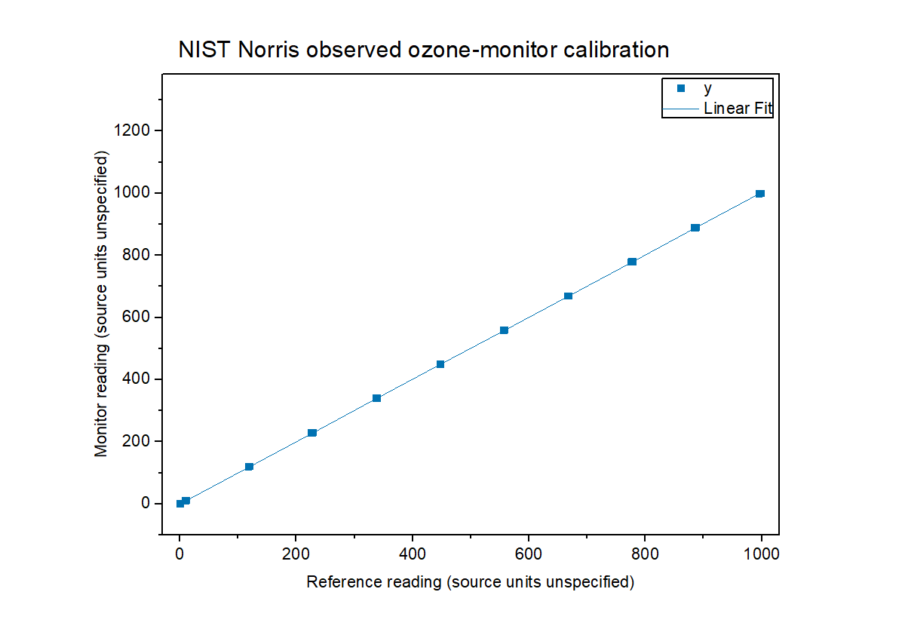
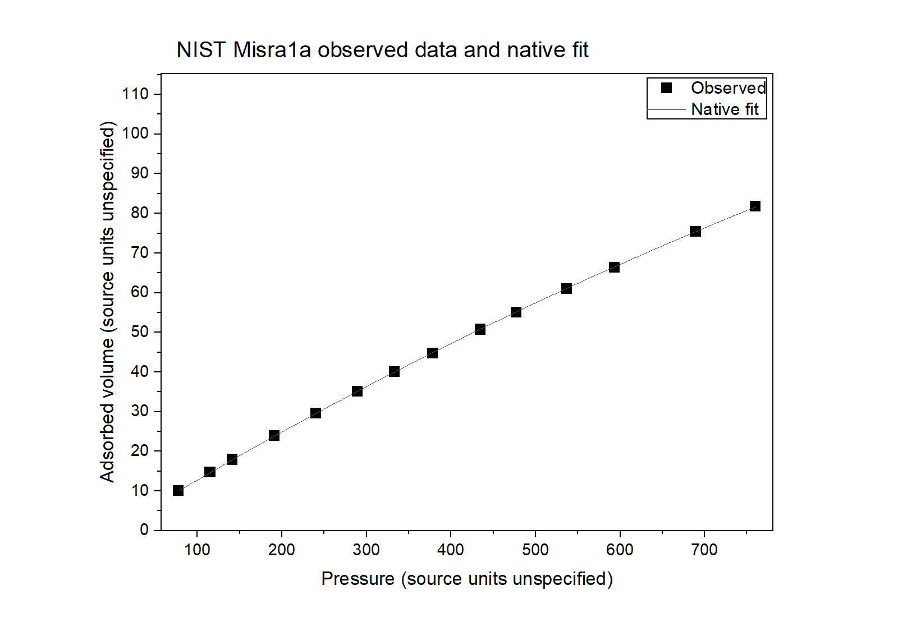
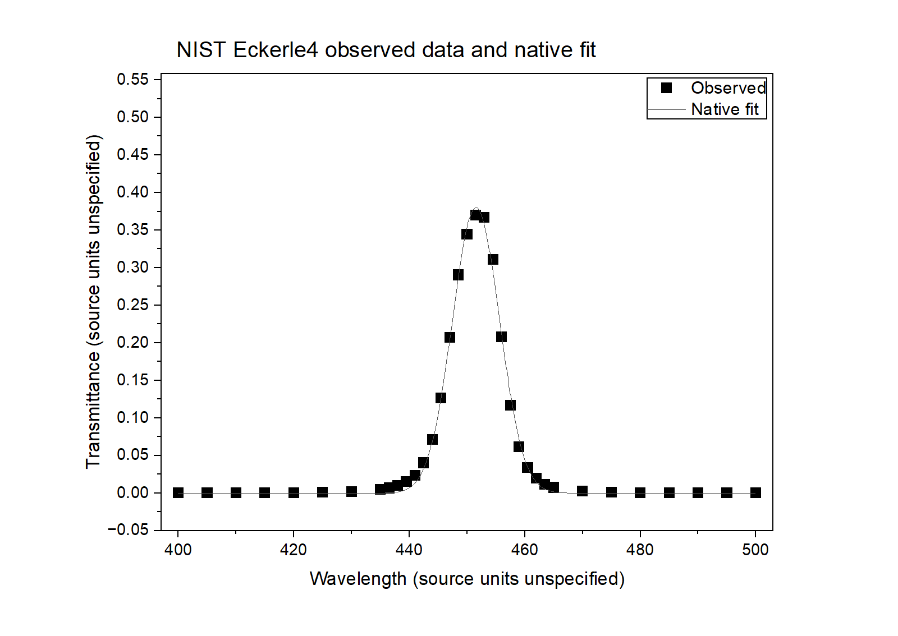
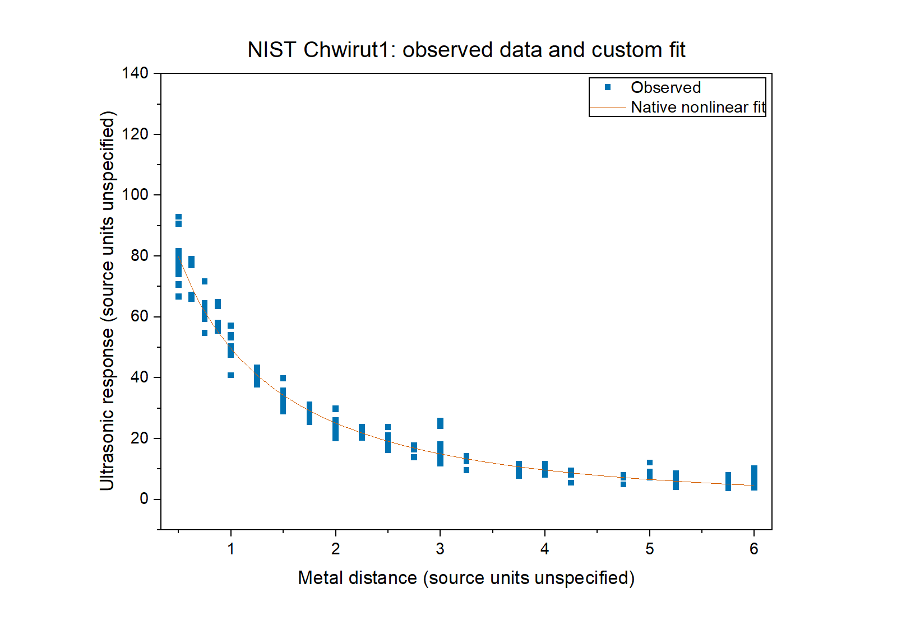

# NIST 真实观测数据验收（2026-09-12）

本轮在首台电脑的已安装 Origin Companion 0.2.7 上，通过 MCP 调用正版 Origin 2026b SR2（10.350243，64 位普通版、非 Demo）。数据来自 NIST 的四份公开 **Observed Data**，共 299 个观测值。独立计算用 Python 标准库完成，拟合、图形和工程由真实 Origin 生成。本记录不替代第二台 SR1 电脑、0.2.8 或其他宿主的独立验收。

| 数据与原始研究 | 行数 | 原生处理与核对 |
|---|---:|---|
| [Norris](https://www.itl.nist.gov/div898/strd/lls/data/Norris.shtml)：臭氧测量仪器校准 | 36 | 自由截距、非加权线性拟合；斜率 1.0021168180204543、截距 −0.26232307377398456、RSS 26.617398529423433，与认证值及独立 OLS 一致 |
| [Misra1a](https://www.itl.nist.gov/div898/strd/nls/data/misra1a.shtml)：吸附实验 | 14 | ExpAssoc1，固定 TD=0、Yb=0；A=238.942129216123、Tau=1817.66483561682，RSS 0.12455138894440412 |
| [Eckerle4](https://www.itl.nist.gov/div898/strd/nls/data/eckerle4.shtml)：干涉滤光片透射率 | 35 | Gauss，固定 y0=0；xc=451.541218169202、w=8.17766491630347、A=3.89625980462372，RSS 0.0014635887487304512；由拟合宽度得到 FWHM=9.628464633228877 |
| [Chwirut1](https://www.itl.nist.gov/div898/strd/nls/data/chwirut1.shtml)：超声校准 | 214 | 注册唯一命名的用户 FDF，用 exp(−b1·x)/(b2+b3·x) 原生非线性拟合；RSS 2384.477149865835；原生统计 n=214、均值 30.26149532710281、样本 SD=23.67979265052397 |

非线性参数按测试前确定的相对容差 1e−4、绝对容差 1e−8 检查，RSS 相对容差为 1e−5。通过表示满足这些容差，不表示恢复了 NIST 公布参数的全部有效位。Misra 模型采用 Tau=1/b2；Eckerle 的 Origin 参数映射为 A=b1√(2π)、w=2b2。FWHM 是从模型宽度计算的派生量，不是独立峰分析模块的验收。

原始文件以 y,x 排列，导入时转换为 x,y，完整保留行序。下载的 StRD 文件没有给出计量单位，图上明确标注 units unspecified；没有补写假定单位、SD 误差棒或拟合权重。Chwirut 同 x 分组的样本散布只作为描述统计，不当作测量不确定度。

四份源数据均完成 OPJU 保存后重开，逐值核对 x/y。另在已保存的非线性工程上开启持续会话、修改标题并关闭，再用新 Origin 实例重开，核对数据和修改仍存在。相同请求返回同一作业；过期会话版本被拒绝，修订号不变。连续编辑的原生步骤用时 0.938 秒，不能把它当成云端模型总耗时。

选定的四张最终图共 12 个 PNG/PDF/SVG 文件均与清单哈希一致。PNG 实际解码并检查；PDF 每份一页，另外用独立渲染器生成图像检查；SVG 解析通过。初次非线性图题与图例布局存在问题，调整后重新导出并复核。下面展示的是最后确认的图，不代表每张自动分析报告图都经过视觉检查。

测试中保留了两类失败：一次测试程序误把 WSheet.lt_exec 的 None 返回值当成布尔成功，修正断言后原生统计通过；一次会话输入路径按规则被拒绝，但 0.2.7 在宿主中显示为泛化的序列化错误，促成 0.2.8 的结构化错误修复。失败作业均进入终态，没有以持续轮询冒充恢复。

可核查的原始来源链接、SHA256、认证参数、容差、实际结果及文件验证数据见 [脱敏机器可读记录](origin-agent/verification/nist-observed-2026-09-12.json)。仅发布 NIST 公开数据相关结果，不包含课程文件、账号、连接密钥或学校私人下载链接。
