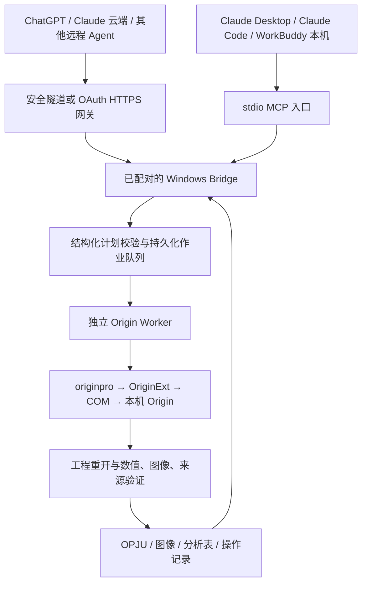

# Origin Agent Bridge：跨平台自然语言自动化插件开发方案

核查日期：2026-09-11。本文保留最初设计与取舍，不能作为当前实现状态。

现已实现独立的 Origin Agent Bridge 0.1.0，交付 Windows ZIP/MCPB、8 个 MCP 工具及宿主清单，并完成本机安装版原生分析验收。最终代码没有依赖 ChemAIst。当前范围、数值与安装证据、各宿主接入进度以 [实现架构](origin-agent/docs/ARCHITECTURE.md)、[安装说明](origin-agent/docs/INSTALL.md) 和 [验收记录](origin-agent/docs/VALIDATION.md) 为准。

## 1. 产品目标与推荐决策

用户在 Claude、ChatGPT、WorkBuddy 或其他支持 MCP 的通用 Agent 中，用自然语言操作自己 Windows 电脑上已获授权的 Origin，完成数据导入、分析、作图、修改和导出，获得可继续编辑的 OPJU 工程及可审阅的分析记录。

推荐建立一个独立的 **Origin Agent Bridge** 产品：共用 MCP 工具契约、工作流引擎和 Origin 执行器，按宿主生成安装入口。复用本机 ChemAIst 已有的 Origin 适配代码，保留与 ChemAIst 的兼容接口；独立插件的运行不要求安装 ChemDraw，也不要求使用某一家模型。

“跨平台”指 Agent 宿主和协议可通用。Origin 计算端先支持 Windows x64；Mac、浏览器或移动端 Agent 通过已配对的 Windows 设备运行任务。每位使用者自行安装、激活 Origin，插件发行包仅提供桥接程序及其允许分发的依赖。

## 2. 本机版本与环境结论

| 项目 | 本轮直接证据 | 对开发的影响 |
| --- | --- | --- |
| 安装产品 | Windows 卸载注册表：Origin 2026b SR2 | 以 2026b SR2 为首个验收版本 |
| 安装包版本 | 10.35.0002；安装日期 2026-09-10 | 与 exe 的文件版本字段分开记录 |
| 构建号 | BuildNum.dat 和用户注册表均为 243 | 与官方 SR2 的 10.350243 对应 |
| 程序路径 | C:\Program Files\OriginLab\Origin 2026b\Origin64.exe | 路径含空格和 b 后缀，发现逻辑不能只拼 Origin2026 |
| 程序完整性 | Authenticode 签名 Valid，签署者 OriginLab Corporation | 已确认正式签名程序存在 |
| 程序架构 | PE Machine = 0x8664 | 已确认 x64 |
| 程序文件版本 | FileVersion 10.3.5；ProductVersion 10.3 | 不能仅用 ProductVersion 判断市场版本 |
| 实际启动 | 已打开工作簿界面；标题为 Origin 2026b (Home-use) - UNTITLED | 启动可用、Home-use 标识已确认 |
| 产品档次 | 当前标题显示 Origin，未显示 OriginPro | 先按基础能力设计；Pro 专属功能须运行时确认，不能从 Python 包名 originpro 推断 |
| 本地许可文件 | 存在 orglab.lic；摘要含 Origin、uncounted、主机绑定、到期字段 2027-10-31 | 这些是文件证据；许可证窗口未完成读取，尚未确认该字段与当前有效许可的对应关系 |
| 内嵌 Python | 安装目录 python311.dll 文件版本 3.11.0 | 与外部 Python 环境独立管理 |
| 当前 ChemAIst Python | Python 3.12.14 x64；没有 originpro 或 OriginExt | 现有原生作业尚不具备 Python 依赖 |
| COM 注册 | 32 位注册表视图存在 Application / ApplicationSI / ApplicationCOMSI 的 LocalServer32，指向 Origin64.exe；64 位视图未见对应项 | COM 是进程外接口；此差异本身不能证明连接失败，须实际验证目标客户端 |
| ChemAIst 状态 | 0.12.20，runtime_identity 校验通过，发现工具数与声明均为 53 | 可以审查、复用现有实现 |

官方发布记录将 Origin 2026b SR2 对应为 2026 年 9 月、构建号 10.350243。[OriginLab 发布历史](https://cloud.originlab.com/index.aspx?go=SUPPORT&pid=3325)

爱丁堡大学化学学院官方页面仍列出面向学生的 Windows Origin，并标明可在个人／家庭电脑使用；该页面不单独证明本机当前许可的全部功能、所有者或有效期。[学院软件页面](https://chem.ed.ac.uk/cto/student-support/computing-software)

本轮软件步骤属于 **prepared-handoff**：已验证正式程序启动，但尚未验证完整 Origin 原生分析和输出。不能据此标为 vendor-native success。

## 3. 可复用基础与实际缺口

现有插件包含两条固定的 Origin 原生工作流：

1. `submit_origin_job`：CSV 的 X/Y 列 → 图形 → OPJU。
2. `submit_beer_lambert_job`：自由截距线性拟合 → OPJU、拟合 JSON、残差 CSV、Origin PNG。

同时已有作业队列、轮询、取消、文件范围限制、输入快照、日志和结果文件检查。它们适合作为起点，但目前不是通用 Origin 自动化产品。

本轮发现的具体问题：

- `applications.py` 的常见安装路径遗漏本机的 `Origin 2026b`，导致 `workbench_status` 和工作流规划报告 Origin 不可用。
- `origin_adapter.py` 另有通配符发现逻辑；本轮直接运行该发现函数，确实返回正确的 Origin64.exe。两套发现逻辑产生相互矛盾的状态。
- 默认作业 Python 缺少 `originpro` 和 `OriginExt`。只补路径不能使原生执行可用。
- 现有代码记录 `origin_executable_launched_directly=false`。Origin 的实例由 Python/COM 建立；配置文件里的 exe 路径不等于实际连接到了该版本。必须验证连接后的运行实例。
- 两条固定工作流不覆盖多曲线、通用模型、模板编辑、批处理、已存工程迭代，也未在本轮验证任何分析输出。

应从可维护的源码仓库修改并发布新版本，不能把用户机器的插件缓存目录当成长期源码。抽取适配器时须一起处理 `jobs`、`safe_io`、审计和结果验证依赖，保留其现有边界。

## 4. 宿主接入与发行方式

| 宿主 | 推荐接入 | 交付物与边界 |
| --- | --- | --- |
| Claude Desktop | 本机 stdio MCP | `.mcpb` 扩展；也可提供 MCP 配置供开发调试 |
| Claude Code | 插件包＋本机 MCP | `.claude-plugin/plugin.json`、`.mcp.json`、共用 skills |
| Claude 网页／移动端及远程连接器 | HTTPS 远程 MCP → 已配对 Windows 设备 | 使用共用认证网关；云端连接不能直接读取电脑的 localhost |
| ChatGPT 个人测试／私有部署 | MCP 连接＋Secure MCP Tunnel，或已认证 HTTPS MCP | 注册连接后安装技能／插件包；隧道的账户权限、工作区关联和客户端可用性须实测 |
| ChatGPT 公开发行 | 正式 HTTPS Streamable HTTP MCP＋插件包 | 完成远程服务认证、设备配对、文件交付和平台审核；开发隧道不等于公开上架方案 |
| WorkBuddy | MCP＋Skill 连接器 | `connector-meta.json`、`mcp.json`、图标及 skills；本机 stdio 或远程 HTTPS |
| 其他通用 Agent | stdio 或 Streamable HTTP MCP | 共用工具、JSON Schema、返回值；单独做宿主兼容验证 |

Claude 官方提供 `.mcpb` 本机扩展路径；Claude Code 插件使用自己的 manifest。二者属于不同安装入口。[Claude Desktop 扩展](https://claude.com/docs/connectors/building/mcpb)、[Claude Code 插件](https://code.claude.com/docs/en/plugins)

Claude 的远程连接从其云端发起；本机 Desktop 配置是另一个机制。[Claude 远程 MCP 说明](https://support.claude.com/en/articles/11175166-get-started-with-custom-connectors-using-remote-mcp)

OpenAI 当前文档支持私有 MCP 的 Secure MCP Tunnel 接入，同时要求普通公开插件提供稳定的 HTTPS 端点；账户与工作区策略会影响可用性。[ChatGPT 连接测试](https://developers.openai.com/plugins/deploy/connect-chatgpt)、[Secure MCP Tunnel](https://developers.openai.com/api/docs/guides/secure-mcp-tunnels)

OpenAI 已说明根目录 `plugin.json`、`mcp.json` 的 portable Agent Plugins 布局及 OpenAI 扩展字段。设计中可使用这一布局作为规范化源，再生成所需的宿主包；WorkBuddy 和 Claude 的打包规范仍要分别适配。[OpenAI 插件打包](https://developers.openai.com/plugins/build/plugins)

WorkBuddy 官方连接器规范明确支持 MCP＋Skill、本机 stdio、远程 SSE／Streamable HTTP，并提供自己的元信息文件；具体字段应按目标版本验证。[WorkBuddy 连接器规范](https://open.workbuddy.cn/docs/connector)

宿主工具权限和市场审核不能由插件统一关闭或代替。产品承诺应是“同一功能核心、各平台可安装与实测”，不能把一份 manifest 当成所有平台已经兼容的证据。

## 5. 执行架构



**Agent 层**负责理解用户、解释结果和补齐真正影响科学结论的参数。**MCP 核心**校验明确的操作计划。**Origin Worker**负责可复现的执行。模型无需直接生成可执行 Python 或任意 LabTalk 字符串。

主接口采用官方 `originpro`。OriginLab 推荐它作为外部 Python 的高层接口，底层通过 OriginExt 和 COM 操作已安装的 Origin；Windows 上要求 Origin 2021 或更新版本。因此本机软件版本满足文档中的最低版本要求，但实际连接仍需验收。[Origin 外部 Python](https://docs.originlab.com/externalpython/)

必要时在内部补充经过测试的 LabTalk／X-Function 模板。Origin C 留给后续确有需要的高级分析扩展。GUI 操作用于安装、许可证诊断和人工复核，不作为主要批处理接口。OrgLab 文件库不承担 Origin 原生拟合或导出引擎的角色。

### 本机 Bridge

- 以用户会话中的后台程序运行，提供托盘状态、设备名称、连接状态和作业列表。
- 本地 stdio 客户端和远程入口共享同一队列；多宿主同时提交时按设备互斥调度，避免各启动一套进程后同时写入 Origin。
- 默认每个作业使用独立的自动化实例和输出目录。人工正在使用的工程走明确的“选定工程副本”流程。
- 区分 `Origin.Application` 与会附着到现有窗口的 `ApplicationSI`；默认批处理选择隔离策略，并验证 originpro 的实际行为。[Origin COM 实例语义](https://docs.originlab.com/com/difference-of-application-applicationsi-and-applicationcomsi/)
- 记录归属自己的进程和会话。取消、超时或重连时，只处理该作业拥有的进程，不能统一结束所有 Origin64.exe。
- 首版内部作业目录放在非同步目录，例如 `%LOCALAPPDATA%\OriginAgent\jobs`。完成并验证后再交付到用户指定位置，处理中文、空格和 OneDrive 路径。

### 云端通路

- ChatGPT 的私有接入优先评估官方安全隧道；其本地端通过出站 HTTPS 连接，不要求公开电脑上的 MCP 监听端口。
- 公共产品提供 OAuth 认证的 MCP 网关，绑定账户、设备和输入／输出权限；本机 Bridge 主动连接网关取任务。
- 网关负责协议和任务转发，Origin 运算留在用户的授权设备上。每个结果必须绑定实际执行设备和作业。
- 电脑离线时返回 `device_offline` 或有明确有效期的排队状态，不能把排队描述为分析完成。
- 图表预览、返回给模型的表格摘要以及用户选择交付的文件会经过相关平台。实现中要记录实际传输范围，不能承诺所有数据始终不离开本机。

## 6. 工具契约

首版向 Agent 暴露少量稳定工具；操作细节放在经过版本化的 WorkflowSpec 中。

| 拟定工具 | 作用 | 关键输出 |
| --- | --- | --- |
| `origin_status` | 查看设备、版本、档次、许可观察、依赖和连接能力 | 各能力分别为 verified / unavailable / unverified |
| `origin_inspect_dataset` | 检查已选输入的表、列、类型、单位、缺失和数据范围 | dataset_id、输入哈希、列概要、需确认问题 |
| `origin_plan_workflow` | 把结构化意图编译为有界计划；不启动分析 | plan_id、计划版本、步骤、输出清单、缺失参数 |
| `origin_run_workflow` | 执行已经校验的计划 | job_id、状态、输入与计划哈希 |
| `origin_get_job` | 轮询进度、错误和结果 | 状态、阶段、artifact_id、可读摘要 |
| `origin_cancel_job` | 取消当前用户拥有的作业 | 取消请求与实际停止结果分别报告 |
| `origin_get_artifact` | 交付工程、预览、表格或日志 | MIME、大小、哈希、受控下载或本机文件句柄 |
| `origin_inspect_project` | 检查已生成工程的表格、图层和分析对象 | project_id、对象标识、修订号 |

文件选择由本机选取器或宿主文件接口完成，服务端发放 `dataset_id`／`artifact_id`。云端文件附件必须先通过该宿主支持的受控通路暂存到执行设备，不能把云端文件 ID 当成本机路径。第一版可先要求用户在本机 Bridge 选好数据；随后补全各宿主上传适配。

`origin_plan_workflow` 返回可读计划并不等于每次都强制二次确认：用户已明确的任务、输入和方法可直接执行；缺少会改变科学结果的参数时才提问。宿主自身要求的工具授权另行保留。

拟定的最小 WorkflowSpec 示例，使用演示字段，不代表本轮运行或真实实验数据：

```json
{
  "schema_version": "origin.workflow.v1",
  "dataset_id": "selected-dataset-id",
  "source_sha256": "resolved-by-service",
  "steps": [
    {"id": "import", "op": "import_table", "x": "concentration", "y": ["absorbance"]},
    {"id": "fit", "op": "linear_fit", "input": "import", "intercept": "free", "weighting": "none", "selection": "all_valid_rows"},
    {"id": "plot", "op": "plot_xy", "input": "import", "fit": "fit", "template_id": "chemistry-calibration-v1"},
    {"id": "residuals", "op": "residual_plot", "fit": "fit"}
  ],
  "units": {"concentration": "mol/L", "absorbance": "dimensionless"},
  "preprocessing": [],
  "outputs": ["opju", "png", "fit_json", "residual_csv"],
  "overwrite": false
}
```

以上自由截距、无权重和选点规则，真实执行时必须由用户输入或方法文件确定，不能因为示例这样写就成为科学默认值。数值缺失不能被 `all_valid_rows` 悄悄排除：检查阶段须先报告无效行，并将实际采用的行号固定到计划。

允许的步骤须通过 JSON Schema 校验，拒绝未知操作、字段及未授权输入。内部脚本由受维护的实现产生。规则约束、单位校验和档次检查必须在服务端生效，不能仅依赖某宿主是否正确加载 SKILL.md。

## 7. 首版功能范围

| 阶段 | 用户可表达的任务 | 验收要求 |
| --- | --- | --- |
| MVP | 导入 CSV／TSV／XLSX，选择 X、Y、误差列 | 列角色、编码、单位、行数可核查 |
| MVP | 散点图、折线图、多曲线、误差棒、图例、坐标轴及模板 | 生成 Origin 图形对象；可在 OPJU 中编辑 |
| MVP | 线性回归与比尔–朗伯标定 | 参数、拟合约束、R²、残差、选点和模型来源完整 |
| MVP | 调整图例、轴范围、单位、颜色并另存新版本 | 使用对象 ID 和工程修订号，保留分析方法 |
| MVP | 批量执行相同已确认流程 | 每个输入独立结果，失败不混入成功列表 |
| 后续 | 已指定模型的动力学与非线性拟合 | 模型、初值、约束、收敛状态及不确定度可追溯 |
| 后续 | 光谱基线、积分、峰分析 | 区间、方法、平滑、峰模型需明确；Pro 功能按实际能力启用 |

首个演示语句可以是：“用我选的标定表，以浓度为 X、吸光度为 Y，做自由截距、无权重线性拟合，绘制残差，保存 Origin 工程和 PNG。”

成功后追加：“把横轴显示为 μmol/L，图例移到右上角，保存第二版。”系统需区分仅改变显示单位和改变数值／回归尺度，必要时澄清，不能把显示调整误作科学模型修改。

每次结果至少包含：OPJU、图形预览、分析结果 JSON／CSV、实际步骤、输入／输出哈希、Origin 完整版本、依赖版本、模板版本、采用和排除行的理由。PDF／SVG 等额外导出按逐格式验证结果启用。

## 8. 科学与工程验证

科学参数应包含列与单位、实验条件、样本归属、模型、截距、权重、范围、误差定义及相关常数。未知样品预测、摩尔吸光系数、速率常数等派生量，仅在对应前提确定时计算。课程方法文件优先用于确定科学约束；展示样式可提供命名默认模板。

每个作业采用以下状态过程：

`queued → running → verifying → succeeded / failed / cancelled / needs_user_input`

采用设备级互斥、持久化 job_id、用户范围的幂等键及计划修订。断线后恢复查询同一 job_id；再次询问进度不会重新执行分析。崩溃后检查最后保存阶段和所有权，不能默认重新运行有副作用的步骤。

**vendor-native success** 的验收条件应同时满足：

1. 实际 Origin 实例的路径、版本、架构与能力已确认，并与所选设备一致。
2. 原生分析／图形操作执行完毕，结果标明来自 Origin；独立 Python 交叉核对必须单列来源。
3. 新生成的 OPJU 可用 Origin 再打开，表格内容、图形对象、分析报告及关联关系完整。
4. 数值与固定参考数据在声明公差内一致，并覆盖已知斜率／截距、缺失值、单位尺度、约束等情形。
5. 预览实际可解码，图形包含预期曲线、轴单位、图例和误差；完成渲染复核。
6. 所有承诺输出均属于本作业，并通过存在性、内容、大小和哈希检查。

“退出码为 0”或“OPJU 非空”均不足以单独通过新版产品验收。原生运行不可用时，可以明确返回 prepared-handoff；如提供开源计算或图形，应标记 open-source fallback，并避免沿用 Origin 的来源标签。

## 9. 开发阶段与通过标准

| 阶段 | 开发内容 | 通过标准 |
| --- | --- | --- |
| P0：本机原生验证 | 统一软件发现；建立独立 Python 环境；能力诊断；实际 COM 连接；明确 Home-use／Standard／Pro 状态 | 使用合成校验数据完成原生导入、拟合、出图、保存与重新打开；返回完整证据 |
| P1：核心工作流 | 抽取并扩展两条现有操作；WorkflowSpec、单位、模板、修改、批处理、持久化队列 | 命令行和 MCP 调用获得同等结果；取消、错误和重试不破坏其他作业 |
| P2：三宿主可安装 | Claude Desktop／Code 包、WorkBuddy 连接器、ChatGPT 私有连接与技能包 | 三个目标宿主分别通过真实安装、工具发现和自然语言交互验收 |
| P3：对外发行 | 公共 HTTPS 网关、OAuth、设备配对、文件上传／下载、签名安装、升级与卸载 | 新用户电脑可安装；账户和设备隔离通过；具备平台提交材料 |

P0 的外部运行环境建议先验证 Python 3.12 x64、`originpro==1.1.15`、`OriginExt==1.2.5`，再锁定版本与 wheel 哈希。本轮 PyPI 元数据确认该 originpro 依赖 OriginExt >=1.2.5，且 OriginExt 提供 CPython 3.12 Windows x64 wheel；这是候选组合，还不是本机连接已通过的结论。[originpro](https://pypi.org/project/originpro/)、[OriginExt](https://pypi.org/project/OriginExt/)

保留单独运行环境，避免要求用户自己处理宿主 Python 与 Origin 内嵌 Python 的差异。产品发行时可将 Bridge 打包为 Windows 可执行程序或版本化安装包；在新环境中验证原生扩展、依赖许可与升级回滚。

三宿主共用的验收语料至少覆盖：直接任务、含糊列名的必要澄清、单位误解、连续修改、批任务局部失败、设备离线、许可失效、重复提交、取消、中文路径、输入变化、实际连接到错误 Origin 版本。除确定性参考数据外，还要加入未见过的列名和用户措辞，检查 Agent 是否正确规划。

## 10. 拟交付目录

以下为开发目标，不表示这些文件已生成：

```text
origin-agent/
  core/                    # 计划契约、单位、作业、错误、审计
  engine/                  # Origin 能力探测与原生操作
  bridge/                  # Windows 后台运行与设备连接
  transports/              # stdio / HTTP；共用业务处理器
  gateway/                 # 公开发行的认证与设备路由
  skills/                  # 宿主中立的工作流说明
  templates/               # 有版本和哈希的 Origin 模板
  packaging/
    portable/              # plugin.json + mcp.json
    claude-desktop/        # manifest.json → .mcpb
    claude-code/           # .claude-plugin + .mcp.json
    chatgpt/               # 注册连接映射、技能和提交材料
    workbuddy/             # connector-meta.json + mcp.json + icon
  verification/            # 原生参考数据和宿主验收记录
```

MCP 工具 schema、技能说明和各宿主元信息应尽可能从同一个能力目录生成。共用版本号与兼容范围；平台层只处理配置、认证、输入暂存和结果显示，不能复制并分别修改核心化学分析逻辑。

## 11. 当前证据边界与下一项工作

目前已完成安装记录、正式程序签名、x64 架构、SR2 构建号、实际启动、依赖缺口、现有适配器和主要宿主接入规范的检查。机器证据详见同目录 `origin-local-evidence.json`。

许可证窗口、OriginPro 能力、实际外部 Python 连接、原生分析产物和三宿主安装仍是待验证项。本轮未把许可文件的到期字段升级为“当前运行许可已经验证到该日”的结论，也未以工作台的检测失败推断 Origin 没有安装。

下一项开发工作应是 P0：在这台已经能启动 Home-use Origin 的电脑上完成完整原生往返验证。P0 通过后，以同一执行核心交付 Claude、ChatGPT、WorkBuddy 三种安装入口。

本轮审计摘要：[session-f3ec45c2425ce77b.md](C:/Projects/.local-data/chemaist/audit/session-f3ec45c2425ce77b.md)；原始事件：[session-f3ec45c2425ce77b.jsonl](C:/Projects/.local-data/chemaist/audit/session-f3ec45c2425ce77b.jsonl)。审计覆盖工具检查与本轮核查摘要，详细环境字段见本机证据 JSON。
