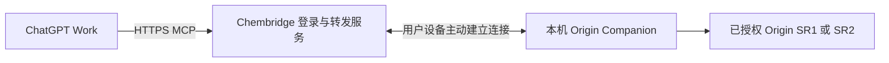

# GitHub 发行与便捷安装

决策日期：2026-09-12。用户选择维持 GitHub 发布，暂不推进公共插件商店、公共转发服务或相关账号体系。优先让非开发者便捷安装和使用。下文的公共目录资料仅作背景记录，不是当前开发前置条件，也不代表已提交审核或获得学校、OriginLab、OpenAI 的认可。

## 一个插件包支持两个 Origin 构建

维护一个仓库、一条 Origin Companion 版本线和一个 Windows x64 安装包。运行时识别 Origin 2026 SR1（10.300197）与 Origin 2026b SR2（10.350243）；在兼容表里分别列出每个构建、宿主和模型的实际验收。两种 Origin 构建不拆成永久分支，也不分发 Origin 本体或学校许可证。

当前 GitHub v0.2.7 是公开预览版；v0.2.8 是资格验收草稿，尚未公开发行。每次发行应附安装包、SHA-256、兼容表、已知问题、安装说明与验收记录。旧发行保留作回滚；新功能或修复使用新的插件版本。真实 Work 验收见 [0.2.8 报告](WORK_ACCEPTANCE_0.2.8.md)。

GitHub 下载及自行连接、工作区内分享、公共插件目录上架是不同的分发方式。公开源码不等于出现在 ChatGPT 公共目录。

## 非开发者安装验收标准

- 一个 Windows x64 ZIP 同时适配两个目标 Origin 构建，用户不需要理解 SR1/SR2 的分包选择。
- 下载、解压、双击安装；使用勾选或清楚的引导选择 Agent，无需克隆仓库、Git、另装 Python 或手改 JSON。
- 自动发现 Origin、核对版本和许可状态，用合成数据做自检后再切换安装；失败时显示原因和下一步。
- 重复安装、升级和重新连接优先复用本人的已有配置与加密凭据。没有观察到凭据缺失、失效或权限不足时，不要求重新生成密钥。
- 首次云端接入涉及服务商登录、权限和工作区关联，由用户在官方界面完成；安装说明必须如实区分这些人工步骤和插件可自动完成的步骤。
- 提供可直接使用的状态检查、重连和恢复入口；用户不应靠开发终端常驻维持正常使用。
- 安装器保留其他插件配置、备份可恢复；研究文件与 OPJU 不随升级删除。
- 发布前按新电脑、已有安装升级、重复运行、中文与空格路径、失败恢复、实际 Agent 调用分别核验。

当前 0.2.8 候选已有自带运行时、安装校验、原生自检、配置合并及回滚；首次宿主选择仍使用文字输入，云端首次接入仍包含脚本和官方账号设置。完整图形安装/云端向导尚未交付，不能宣传为全程一键完成。

## 公共目录背景资料（暂停推进）

按当前 [提交文档](https://developers.openai.com/plugins/deploy/submission)，个人或企业均可作为开发者，但发布身份须完成验证，提交者须拥有 Apps Management Write 权限。准备名称、描述、图标、网站、支持入口、隐私政策、条款、发行说明和可用地区；至少提供五个正向与三个负向可重现案例。认证服务须提供审核人员可完成流程的测试账号与样本数据，不能依赖其访问内部网络或无法完成的二次验证。提交后需审核，通过后由开发者选择发布。

对包含 MCP 的插件，还需稳定、公开可达的生产 HTTPS MCP 地址、域名验证和准确的工具元数据。自定义 UI 可选；提供 UI 时须配置对应 CSP。[远程 MCP 要求](https://developers.openai.com/plugins/deploy/app-review)建议使用统一服务地址；每客户不同地址的模板模式仅面向经批准的开发者。

[Secure MCP Tunnel 官方说明](https://developers.openai.com/api/docs/guides/secure-mcp-tunnels)明确：该隧道支持私有连接与测试，不支持公共插件提交或分发。当前个人隧道验收成功不能直接证明可上架。公开提交文档对本地 MCP 支持要求联系 OpenAI，不能把尚未获准的能力当作默认路线。

[插件规则](https://developers.openai.com/plugins/app-guidelines)要求可靠、如实描述功能和权限、最小化数据处理，并限制主要作为第三方服务非官方连接器的插件。Origin Companion 的本机软件自动化是否落入该限制，现有文档没有给出具体结论；应先向 OpenAI 确认适用性，并核实所用接口、标识和分发材料的权利。不能因使用正版软件或补齐公网服务，就承诺公共目录审核通过。

## 如获准公开提交，建议增加的服务层

以下是架构建议，尚未部署：

云端服务负责登录授权、用户与设备绑定、按用户隔离的任务转发、撤销连接、限流与必要的短期文件交付；Origin 计算仍在使用者自己的 Windows 设备上进行。不能把所有用户请求发到开发者电脑，也不应收集用户的 OpenAI 密钥。普通用户的预期流程是安装执行端、登录并配对自己的设备，然后在 Work 使用。

沿用既有原生执行与验证内核，本地 Agent 可继续使用本机 MCP。公共服务需额外核验跨账号隔离、设备离线提示、断线重连、重复请求、超时取消、导出文件访问控制，以及可声明的功能范围。通用 Python/LabTalk/Origin C 执行须有清楚的设备授权和权限边界；不能把任意远程代码执行默认授权给未绑定设备或其他用户。

该路线增加域名、托管、带宽、可用性维护和安全更新成本。已查文档没有列出统一上架申请费，不能据此保证全部免费或固定审核时间。无需为提供工具转发额外运行一套语言模型，但宿主模型本身仍按各账户规则计费。

## 推荐顺序

先完成指定版本及实际 Agent 工作入口验收，发布具有明确边界的 GitHub 分享包，并优先减少安装和首次连接的手工步骤。公共商店受理咨询、服务建设和审核提交暂不推进。学校官方发行和学校 SSO 不作为当前个人分享包的前置要求。
