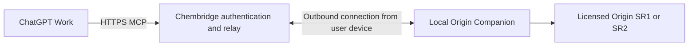

# GitHub distribution and accessible installation

Decision date: 2026-09-12. The user chose GitHub distribution, with no current work on public plugin-store submission, a public relay service or an associated account platform. Prioritise accessible installation and use for non-developers. Public GitHub content is maintained in English. Store information below is dated background research, not a prerequisite, submission or endorsement by the university, OriginLab or OpenAI.

## One plugin package, two Origin builds

Maintain one repository, one Origin Companion version line and one Windows x64 package. Detect **Origin 2026 SR1 (10.300197)** and **Origin 2026b SR2 (10.350243)** at runtime. Record each build, host and model's acceptance separately; do not create permanent branches for the two Origin builds or distribute Origin and university licences.

**[v0.2.8](https://github.com/saigyujikingyo-png/origin-agent-bridge/releases/tag/v0.2.8) is the current public preview.** The earlier qualification archive remains a separate unpublished draft. Releases include packages, SHA-256 information, compatibility, known issues, installation instructions and acceptance evidence. Retain older releases for rollback and use a new plugin version for runtime fixes or features. See the [0.2.8 Work report](WORK_ACCEPTANCE_0.2.8.md).

GitHub downloads with individual connection setup, workspace sharing and listing in a public plugin directory are distinct distribution routes. Open source does not automatically create a ChatGPT directory listing.

## Installation acceptance for non-developers

- One Windows x64 ZIP supports both target Origin builds; users should not need to select an SR1/SR2-specific package.
- Download, extract and double-click, with a clear agent selection flow. No source clone, Git, separate Python installation or manual JSON editing.
- Discover Origin, verify version/licence, self-test with synthetic data before switching the active installation, and report failures with next steps.
- Reuse the user's existing settings and encrypted credentials during repeated installation, upgrades and reconnection. Request new credentials only when actually missing, invalid or insufficiently permitted.
- Clearly identify first-time provider login, permissions and workspace association that users must complete through official interfaces.
- Provide status, reconnection and recovery entrypoints; routine use should not depend on a persistent development terminal.
- Preserve other plugins' configuration, recoverable backups, research files and OPJU projects.
- Verify new-device installation, upgrade, repeat execution, paths containing spaces and Chinese characters, recovery and real agent calls before claiming them supported.

0.2.8 includes a bundled runtime, package checks, native self-test, configuration merging and rollback. Initial host selection still uses text input; first-time cloud setup still includes scripts and official account settings. A complete graphical installation/cloud wizard has not been delivered, so the entire flow must not be advertised as one click.

## Public-directory research: deferred

The [submission documentation](https://developers.openai.com/plugins/deploy/submission) reviewed on 2026-09-12 described verified individual/business publishers with Apps Management Write permission, preparation of identity, name, description, icon, website, support, privacy policy, terms, release notes and availability, plus at least five positive and three negative reproducible cases. Authenticated services need reviewer access and sample data without inaccessible internal networks or uncompletable secondary authentication. Review and subsequent publication are separate steps; verify current requirements before any future submission.

For MCP plugins, the reviewed [remote MCP requirements](https://developers.openai.com/plugins/deploy/app-review) called for a stable production HTTPS endpoint, domain verification and accurate metadata. Custom UI is optional and requires the appropriate CSP when supplied. A unified endpoint was recommended; customer-specific endpoint templates required approval.

The reviewed [Secure MCP Tunnel documentation](https://developers.openai.com/api/docs/guides/secure-mcp-tunnels) described private connections/testing, not public plugin submission or distribution. A successful private tunnel test does not establish store eligibility. The submission guidance directed developers to contact OpenAI about local MCP support; unapproved capability is not the default distribution plan.

The reviewed [plugin guidelines](https://developers.openai.com/plugins/app-guidelines) require reliability, accurate capability/permission descriptions and minimal data processing, and restrict some unofficial connectors to third-party services. They did not explicitly settle how Origin Companion's local software automation would be assessed. Confirm eligibility and rights to interfaces, branding and distributable materials before committing to submission. A licensed Origin installation or public endpoint does not guarantee approval.

## Possible service layer if public submission is approved

This is a proposal, not a deployed service:

The service would handle authentication, user/device association, isolated job forwarding, revocation, rate limits and necessary short-term file delivery. Origin would still run on each user's Windows device. Do not forward everyone's work to the developer's computer or collect users' OpenAI keys. The intended flow is to install the runtime, sign in and pair a personal device, then use Work.

Reuse the existing native execution and verification core; local agents can retain local MCP. Additional acceptance would cover account isolation, offline devices, reconnects, duplicate requests, timeout/cancellation, artifact access and declared capability scope. General Python/LabTalk/Origin C execution requires clear device authorisation and permission boundaries; it is not implicitly authorised for unpaired devices or other users.

This route adds domain, hosting, bandwidth, availability and security-maintenance costs. The reviewed documentation did not specify a universal submission fee; that does not guarantee free operation or a fixed review time. Tool forwarding does not require another language-model service, while the host model remains subject to each account's terms.

## Current priority

Finish acceptance on the specified Origin versions and real agent work entrypoints. Publish GitHub sharing packages with clear limitations and reduce manual installation/first-connection steps. Public-store enquiries, infrastructure and submission are deferred. Official university distribution and campus SSO are not prerequisites for this personal sharing package.
