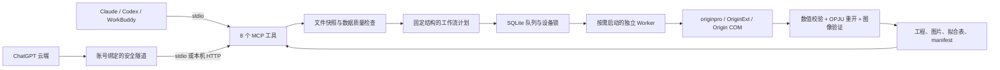

# Origin Agent Bridge：实现架构

当前版本：0.2.7。产品目标已扩大为 Agent 访问本机授权 Origin 的完整功能。[完整功能架构与当前边界](FULL_ORIGIN.md)描述新增通用程序执行、功能检索和现有工程副本编辑。下文保留 0.1 固定工作流子系统的详细设计；其中“固定操作”“不开放任意脚本”等限制只适用于该子系统，不能作为整个 0.2 插件的权限或功能声明。



## 代码职责

| 文件 | 实现内容 |
|---|---|
| `models.py` | 封闭的 Pydantic 工作流协议；拒绝多余字段、无限值和不完整科学参数 |
| `discovery.py` | 共用的注册表与安装目录发现；兼容空格和版本 b 后缀 |
| `datasets.py` | CSV/TSV/XLSX 检查、完整输入快照、列质量摘要、数值预检 |
| `planning.py` | 一次规划多面板；按规范化内容计算计划哈希；检测计划与输入变更 |
| `storage.py` | 原子 JSON、SHA-256、文件范围控制、跨进程锁 |
| `jobs.py` | SQLite 队列、重复提交复用、跨宿主串行调度、取消、超时和中断状态 |
| `native.py` | 独立 Origin 实例、原生拟合与绘图、工程重开、数据和数值核对 |
| `server.py` | 8 个 MCP 工具、最长 25 秒等待、按需图片预览和文件资源 |
| `cli.py` | 本机诊断、stdio 与仅监听回环地址的 HTTP 入口 |
| `generate_hosts.py` | 统一生成 Claude、Codex、portable Agent Plugins 和 WorkBuddy 清单 |
| `build_release.py` | 冻结 Python 运行时、许可证、校验和、Windows ZIP 和 MCPB |
| `Install.ps1` | 完整性检查、安装、按本机路径生成宿主配置；不要求管理员或 Python |

数据目录使用 `%USERPROFILE%\.origin-agent`。选择家目录下独立目录，是为了避开 OneDrive 同步锁和不同 MSIX 应用对 LocalAppData 的重定向。各宿主共享队列与不可变快照。可通过 `ORIGIN_AGENT_HOME` 指定另一处本地目录；所有宿主必须使用相同值才能共享设备锁。

## 具体接口

工具只有 `origin_status`、`origin_inspect_dataset`、`origin_plan_workflow`、`origin_run_workflow`、`origin_get_job`、`origin_cancel_job`、`origin_get_artifact`、`origin_inspect_project`。

典型路径为一次文件检查、一次计划、一次执行、一次长等待、一次图片预览。健康状态通常每个会话读取一次。多面板放入同一工作流，无需逐列、逐图和逐菜单调用。

输入示例（由 Agent 根据用户任务填写，不要求用户编写）：

```json
{
  "panels": [{
    "dataset_id": "由文件检查返回的32位ID",
    "x": "Concentration",
    "y": ["Absorbance"],
    "analysis": {"kind": "beer_lambert", "intercept": "free", "weighting": "none"},
    "style": {"x_label": "Concentration (mmol/L)", "y_label": "Absorbance", "colors": ["#0072B2"]}
  }],
  "formats": ["png", "pdf", "svg"]
}
```

拟合截距和权重不采用隐含默认值。误差棒仅表示所给误差列；不能自行推断为标准差、标准误或拟合权重。Beer–Lambert 的摩尔吸光系数必须同时提供光程和浓度换算；未知样品浓度会标记是否外推，尚不计算未知样品的不确定度。

## 性能与额度效率

- 单一 Python 执行栈，没有 Electron 外壳、容器、向量数据库或额外模型调用。使用官方 MCP SDK 2.2，保留协议兼容性而不自造简化协议。
- Origin 只在执行时启动；后台检查和规划不加载 Origin。一次任务中的多个面板共用实例，完成后退出。没有常驻的 Origin 进程。
- SQLite 使用 WAL，设备锁由操作系统回收。调度器仅在有作业时运行；多个宿主不会同时修改同一个 Origin 实例。
- 默认返回最多四行预览、列统计和摘要；完整数据留在快照中。图片、JSON 和 OPJU 按需读取。任务查询支持长等待，完成结果可重复读取。
- 相同计划 ID 只执行一次。修改模型或样式生成新计划；明确重试可设置新的 `revision`，保留旧结果。
- 一次图形回合通常不需要查询整份 API 文档或让模型生成脚本。8 个工具的实际清单规模及时间记录见验收文档；字符量不是模型实际 token 或账户计费量。
- Windows 安装包内置运行时；使用目录形式的可执行程序，避免单文件 EXE 每次解压。首版 ZIP 约 31 MiB，最终值以发行校验清单为准。

权衡是 MCP SDK 及其类型、网络依赖占据部分包体积；原生 Origin 的启动本身也有数秒成本。当前优化重点是批量执行和减少模型往返，而不是牺牲协议实现或数值验证。

## 科学结果与可靠性

所有科学计算以 Origin 为执行端。线性拟合同时用一个独立的最小二乘公式检查系数、残差平方和及使用行数；它只作为校验，不替代 Origin。工程保存后，用独立任务实例重开自己的输出，重新读取所有所用数据列，验证哈希、图和原生拟合报表存在，再发布 manifest。

实测发现 Origin 会自动把邻近误差列用作权重。因此执行器显式设置 `Fit.ErrBarWeight=0`，检查运行时数值设置并核对计算结果。这个字段取自本机官方随附 `FitLinear.cpp` / `stats_types.h`；它被限制在固定适配器中，依赖版本已锁定，后续 Origin 版本需要重跑原生验收。

Windows 中原子替换 JSON 可能短暂遇到读取句柄或防病毒软件占用，代码采用有上限的重试，保留原子性。中断、超时或取消不会把部分文件标为成功。只有在新建 COM 实例后能唯一识别对应 Origin PID，并核对进程创建时间时，才允许强制终止它；身份不确定时不会终止其他 Origin 进程。

当前 OPJU 重开采用普通加载模式，且只加载插件自己的新产物。实测中只读加载路径未能通过数据往返核对，不能将该路径视为已支持。任意外部 OPJU 的解析、执行和手动编辑保留尚未开放。

## 能消除哪些 GUI 摩擦

用户可以说：“根据这份数据和实验手册做标准曲线，显示误差棒，导出可编辑工程”，接着用“修改颜色、单位标签、图宽、截距设置”迭代。常见操作无需记菜单层级、列指定、拟合对话框、报告输出和导出选项。失败时可依据同一计划复查具体阶段，而不是重新从头点击。

自然语言降低的是操作与发现功能的成本；它不会替用户确定实验模型、误差定义或物理合理性。插件应该集中询问真正缺失的科学参数，而不把模型产生的猜测隐藏在漂亮图像后面。

当前覆盖 CSV/TSV/XLSX 值、多 Y 曲线、误差棒、普通线性拟合、固定零截距拟合、Beer–Lambert 校准、批处理和样式重建。峰分离、复杂非线性模型、多因素统计、任意 Origin 模板和任意手动工程编辑不属于此版本。扩大功能应按实验任务逐项增加固定适配器和数值验收，而非直接暴露任意脚本。

## 宿主与后续扩展边界

Claude Desktop 使用自包含 `.mcpb`；Claude Code / Codex 使用插件清单与 skill；WorkBuddy 使用连接器清单与本机 MCP 配置。它们共享执行器，不需要各自维护科学计算逻辑。

ChatGPT 云端需要可用的安全隧道，或认证 HTTPS 网关。当前交付隧道连接脚本、stdio/回环 HTTP 服务和 skill，未实现公网多租户网关、OAuth 设备配对及云端附件自动同步。隧道账号权限不随 ZIP 安装包分发。仅有清单文件不能宣称已经完成 ChatGPT 账号内的调用测试。

未来公网层可保持本机代码不变，增加 OAuth 2.1 网关、设备出站连接、作业签名、范围受限的文件上传下载以及账号隔离。只有真的需要公共分发时再增加这层，避免个人科研使用先承担云服务维护成本。

来源： [Origin 官方外部 Python](https://docs.originlab.com/externalpython/)、[MCP Python SDK](https://github.com/modelcontextprotocol/python-sdk)、[MCPB 规范](https://github.com/modelcontextprotocol/mcpb/blob/main/MANIFEST.md)、[WorkBuddy 连接器规范](https://open.workbuddy.cn/docs/connector)、[OpenAI 插件规范](https://developers.openai.com/plugins/build/plugins)、[Secure MCP Tunnel](https://developers.openai.com/api/docs/guides/secure-mcp-tunnels)。
