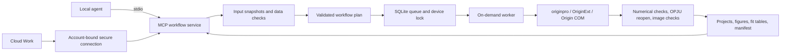

# Origin Companion architecture

The current product combines fixed workflows, general native programs, persistent sessions and GUI interaction. See [FULL_ORIGIN.md](FULL_ORIGIN.md) and [IMPLEMENTATION_PLAN.md](IMPLEMENTATION_PLAN.md) for the expanded 0.2 design. The detailed subsystem below originated in **0.1**: its eight-tool interface and fixed-operation restrictions describe that subsystem, not the full current plugin. Current economy/full modes expose five/14 tools respectively.



## Module responsibilities

| Module | Responsibility |
| --- | --- |
| `models.py` | Closed Pydantic workflow contract; reject extra fields, nonfinite values and incomplete scientific arguments |
| `discovery.py` | Shared registry/install discovery, including spaces and version suffixes |
| `datasets.py` | CSV/TSV/XLSX inspection, full snapshots, column summaries and numerical preflight |
| `planning.py` | Multi-panel plans, normalised-content hashes and input/plan change detection |
| `storage.py` | Atomic JSON, SHA-256, path scope and process locks |
| `jobs.py` | SQLite queue, deduplication, serial cross-host scheduling, cancellation, timeouts and interrupted states |
| `native.py` | Separate Origin instance, native fitting/plotting, reopen and numerical/data checks |
| `server.py` | MCP tools, bounded waits of up to 25 seconds, on-demand previews and resources |
| `cli.py` | Diagnostics, stdio and loopback-only HTTP |
| `generate_hosts.py` | Shared generation of Claude, Codex, portable Agent Plugins and WorkBuddy metadata |
| `build_release.py` | Frozen Python, licences, checksums, Windows ZIP/MCPB |
| `Install.ps1` | Integrity checks, installation and machine-specific configuration without administrator/Python requirements |

State lives at `%USERPROFILE%\.origin-agent` to avoid OneDrive locks and different MSIX applications' LocalAppData redirection. Hosts share the queue and immutable snapshots. `ORIGIN_AGENT_HOME` can select another local directory; all hosts must use the same value to share a device lock.

## Fixed workflow contract

The original operations are `origin_status`, `origin_inspect_dataset`, `origin_plan_workflow`, `origin_run_workflow`, `origin_get_job`, `origin_cancel_job`, `origin_get_artifact` and `origin_inspect_project`. In current economy mode, use the advertised recipe/help/call routes to reach operations on demand.

A typical workflow inspects once, plans once, submits once, waits with a bounded long poll and reads a preview. Status normally needs one check per session. Put related panels in one workflow rather than making calls per column, graph or menu.

Illustrative arguments prepared by the agent, not written by the user:

```json
{
  "panels": [{
    "dataset_id": "32-character-id-returned-by-inspection",
    "x": "Concentration",
    "y": ["Absorbance"],
    "analysis": {"kind": "beer_lambert", "intercept": "free", "weighting": "none"},
    "style": {"x_label": "Concentration (mmol/L)", "y_label": "Absorbance", "colors": ["#0072B2"]}
  }],
  "formats": ["png", "pdf", "svg"]
}
```

Fit intercept and weighting have no implicit scientific defaults. An error column does not by itself establish SD, SE or fitting weights. Molar absorptivity additionally requires path length and concentration conversion. Unknown concentration is flagged if extrapolated; this fixed adapter does not calculate its uncertainty interval.

## Performance and quota

- One Python execution stack, without an Electron shell, containers, vector database or extra model calls. The implementation uses the official MCP SDK rather than an invented partial protocol.
- Fixed jobs start Origin only for execution. Inspection/planning do not load it; panels share an instance which exits on completion. Persistent 0.2 sessions have their own lifecycle.
- SQLite uses WAL; operating-system locks recover on process exit. Scheduling runs when jobs exist, and hosts do not concurrently edit one instance.
- Default responses contain at most four preview rows, column statistics and summaries. Full data stays in snapshots; images, JSON and OPJU are read on demand. Completed jobs remain readable.
- The same plan ID executes once. Model/style changes produce a new plan; an explicit new `revision` allows a deliberate retry while preserving old results.
- Typical fixed workflows avoid a full API-manual lookup or generated script. Schema characters are not actual billed tokens.
- The Windows directory-based executable avoids unpacking a single-file EXE at every launch. Early ZIPs were about 31 MiB; consult release checksums for exact sizes.

The MCP SDK and its typed/network dependencies contribute to package size; native Origin startup also takes time. Batch execution and fewer agent round trips are preferred over sacrificing protocol or numerical verification.

## Scientific and execution checks

Origin performs the analysis. An independent least-squares calculation verifies coefficients, RSS and row count; it does not substitute for Origin. After saving, a separate task instance reopens the generated OPJU, rereads every used data column, verifies hashes and the presence of graphs/native reports, then publishes the manifest.

Origin was observed automatically using adjacent error columns as weights. The unweighted adapter explicitly sets `Fit.ErrBarWeight=0`, checks runtime settings and compares numerical results. The field was checked against bundled official `FitLinear.cpp` / `stats_types.h`; it is confined to the version-specific adapter, and new Origin builds require native acceptance.

Windows atomic JSON replacement uses bounded retries for short-lived reader/antivirus locks. Interrupted, cancelled or timed-out jobs do not publish partial output as successful. Forced termination is allowed only after uniquely identifying the created Origin PID and its creation time; ambiguous ownership must not terminate another Origin process.

The original fixed subsystem reopens only its own output in normal load mode. The tested read-only load path failed data round-trip checks and was not accepted. Editing external OPJU copies is a separate 0.2 general-program/session capability.

## Reducing GUI and learning friction

Users can request a calibration figure with supplied errors and an editable project, then revise colours, unit labels, width or fit constraints. Common tasks avoid learning menu hierarchies, column designations, fit dialogs, report settings and export options. Recorded plans identify failure stages without repeating all manual steps.

Natural language reduces operation/discovery effort; it does not establish the experimental model, error meaning or physical plausibility. Ask for missing scientific inputs rather than hiding guesses behind a polished figure.

The fixed subsystem supports tabular values, multiple Y series, error bars, free/zero-intercept linear fits, Beer–Lambert, batching and style rebuilds. More complex fitting, peak analysis, statistics, templates and live editing use separate native/program/GUI routes with their own acceptance; they are not certified by these fixed cases.

## Hosts and optional public service

Claude Desktop uses a self-contained MCPB; Claude Code/Codex use their metadata and skills; WorkBuddy uses connector metadata and local MCP configuration. All share one scientific executor.

Cloud Work uses the user's supported secure connection. The package includes connection scripts, stdio/loopback HTTP and skills, but no public multi-tenant gateway or OAuth device-pairing service. Current cloud table import and artifact delivery are documented separately; arbitrary attachment synchronisation is not automatic. A manifest or healthy tunnel is not proof of a real account workflow.

If public distribution later requires a service, add authenticated device outbound connections, scoped transfer and account isolation only then. Keep computation on the user's licensed Windows device and avoid premature service-maintenance cost.

Sources: [Origin external Python](https://docs.originlab.com/externalpython/), [MCP Python SDK](https://github.com/modelcontextprotocol/python-sdk), [MCPB manifest](https://github.com/modelcontextprotocol/mcpb/blob/main/MANIFEST.md), [WorkBuddy connectors](https://open.workbuddy.cn/docs/connector), [OpenAI plugins](https://developers.openai.com/plugins/build/plugins), [Secure MCP Tunnel](https://developers.openai.com/api/docs/guides/secure-mcp-tunnels).
